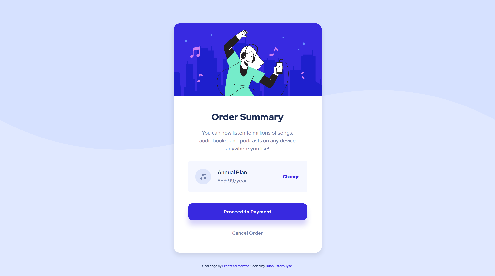

# Frontend Mentor - Order summary card solution

This is my solution to the [Order summary card challenge on Frontend Mentor](https://www.frontendmentor.io/challenges/order-summary-component-QlPmajDUj). Frontend Mentor challenges help you improve your coding skills by building realistic projects.

### Screenshots

## mobile-version

## desktop-version

### Built with

- Mobile-first workflow
- Semantic HTML5 markup
- Sass

## Author

- Frontend Mentor - [@RuanEsterhuyse](https://www.frontendmentor.io/profile/RuanEsterhuyse)
